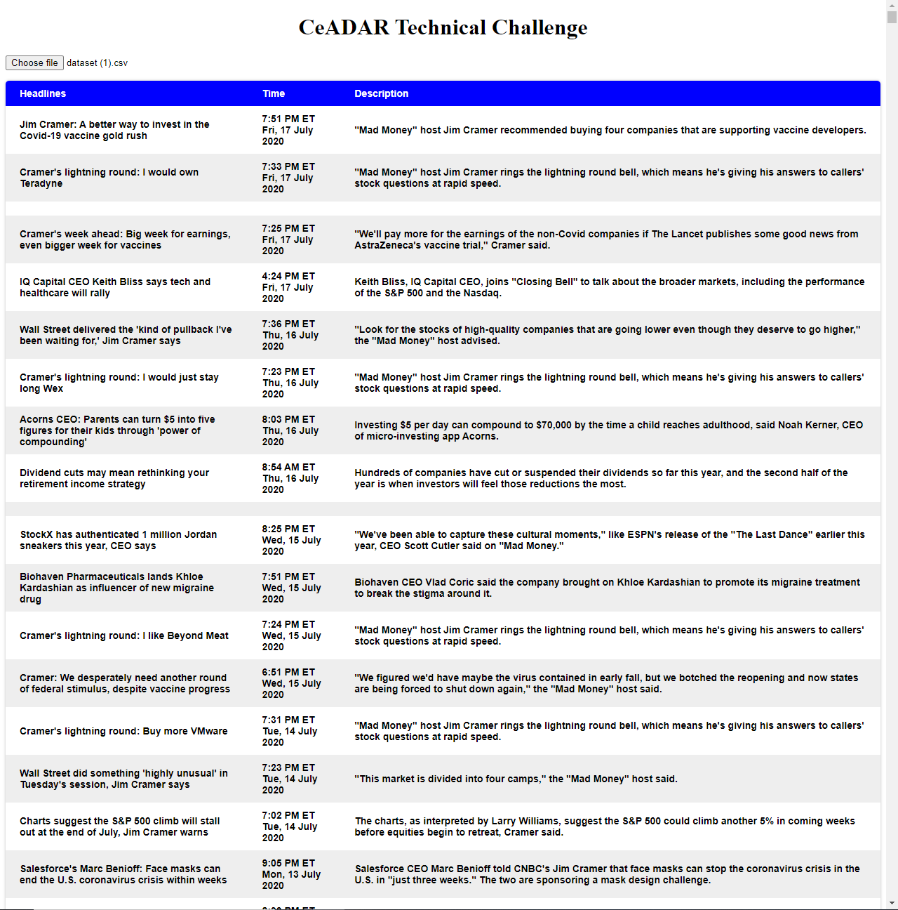

# CSV Reader With Node.js

This application uses node.js to create a web application which reads in a CSV file from the client and displays it in a CSS styled table. A localhost server was created in order to create the application

The front-end of the web application is seen below:

